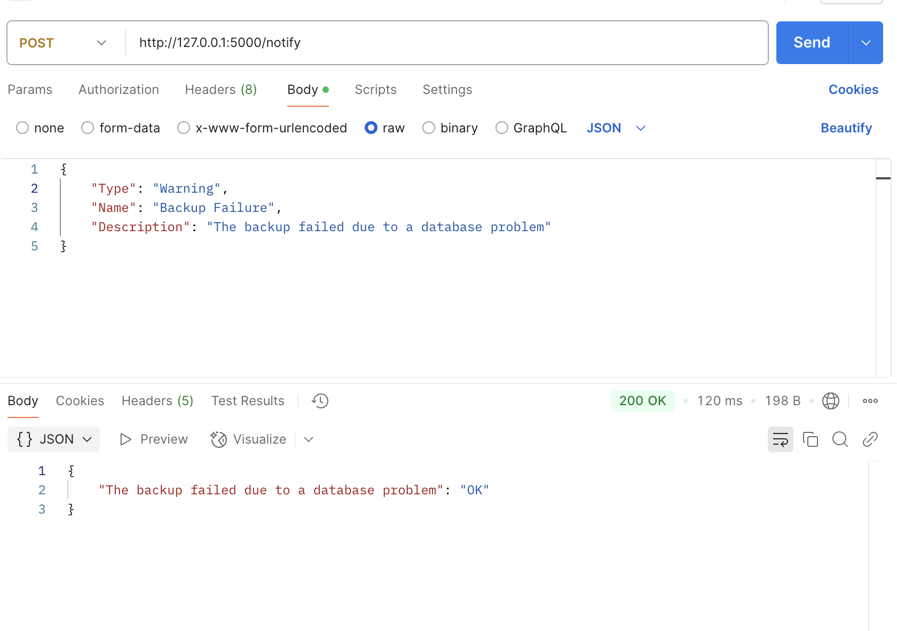
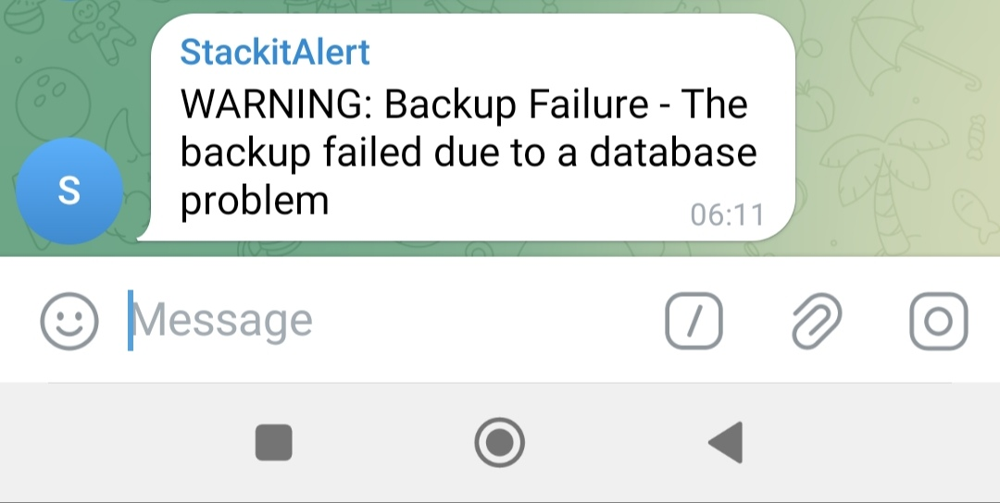

# telegram-alert-api

### Get TELERAM_BOT_TOKEN and TELEGRAM_CHAT_ID 
1. Find telegram bot named "@botfarther"
3. To create a new bot type `/newbot`
4. Choose a name for your bot, then a username that must end with "bot"
5. Copy your API token to your .env file
6. type `/setprivacy`, then select your bot
7. Choose `Disable` to allow the bot to read all messages in the group
Then, create a group on telegram,
8. Add your bot to the group
9. Send a test message in the group
10. Run
    ```shell
    curl -X GET "https://api.telegram.org/bot<YOUR_BOT_TOKEN>/getUpdates"
    ```
    you will see
    ```json
    "chat":{"id":-123456789,"title":"Group Name"}
    ```
    in the response
12. Copy the negative value to your .env file
13. Your .env file must look like this 
```.env
TELEGRAM_BOT_TOKEN =YourApiToken
TELEGRAM_CHAT_ID =YourGroupId
```

### Clone and run (Linux/MacOS)
Clone the repository
```shell
git clone https://github.com/djedd1ne/telegram-alert-api.git
```
Navigate into the directory
```shell
cd telegram-alert-api/
```
Create a virtual environment
```shell
python3 -m venv venv
```
Activate venv
```shell
source venv/bin/activate
```
Install requirements
```shell
pip install -r requirements.txt
```
Run with Gunicorn
```shell
gunicorn -w 1 -b 0.0.0.0:5000 wsgi:app
```
Use this comand to get your IP address (Linux/MacOS) to use it with curl on Postman
```shell
ifconfig
```

### Tests and Usage
1. Using curl (On the same machine use 127.0.0.1:5000)
* Send a valid notificaton
```shell
curl -X POST http://127.0.0.1:5000/notify \
     -H "Content-Type: application/json" \
     -d '{"Type": "Warning", "Name": "Backup Failure", "Description": "The backup failed due to a database problem"}'
```
Response
```json
{"The backup failed due to a database problem":"OK"}
```
* Retrieve all notifications
```shell
curl -X GET http://127.0.0.1:5000/notifications
```
Response 
```json
[{"Description":"The backup failed due to a database problem","Name":"Backup Failure","Type":"Warning"}]
```

2. Using Postman
* Send "Warning" notification
   	
* The message on telegram group
   
